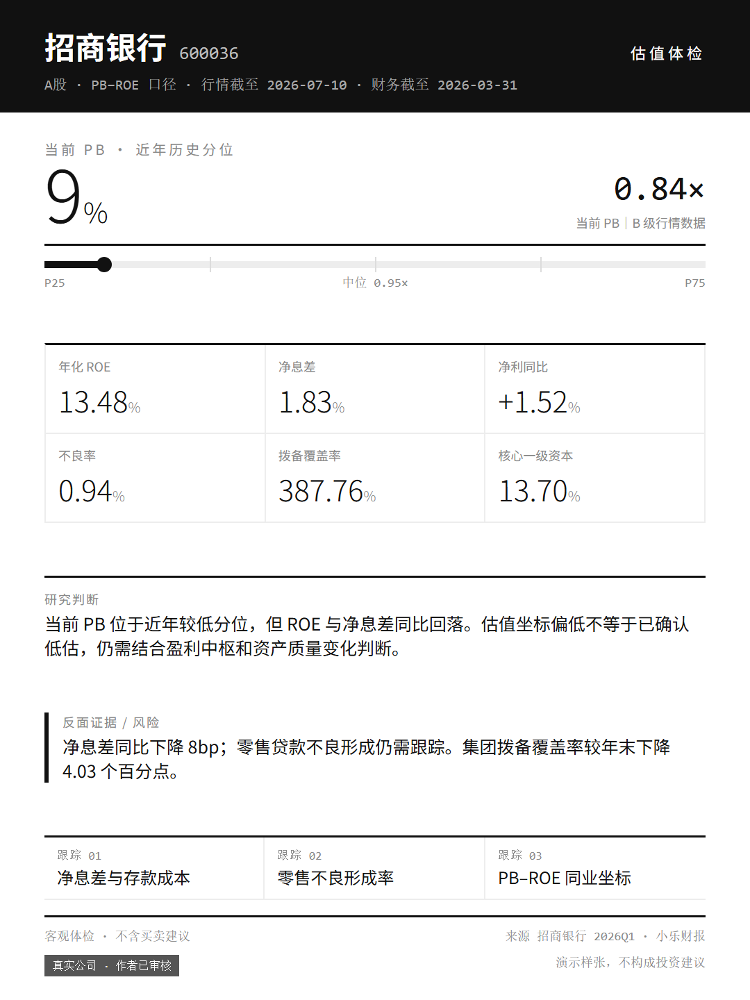
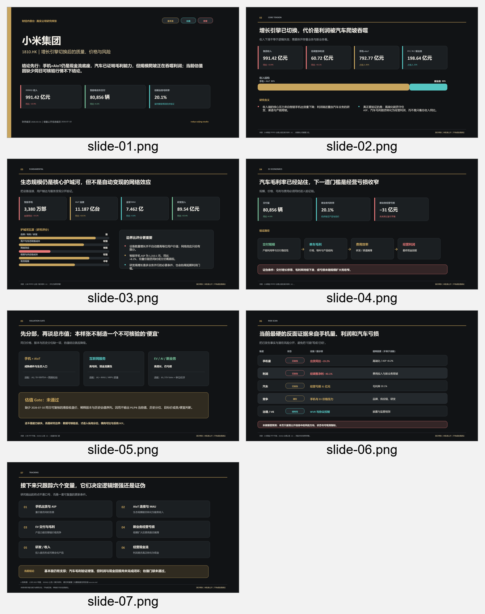

# 📊 财经内容台 · rodya-caijing-studio

## 把一句“分析一下”，变成一份专业财经研究报告

覆盖 A股与港股的基本面、财报、估值、排雷、产业链和新股研究。核验数据时效，标注来源与证据边界，给出可追踪、可证伪的研究结论。默认交付专业 DOCX，按需生成客户合规卡片与汇报 PPT。

> **7 个研究模块 · A股 + 港股 · 专业研究内核 · 数据时效 Gate · 三种交付形态 · 客户合规渲染**

它不是荐股器，也不是情绪化喊单模板。它把研究方法、数据来源、风险提示和合规表达放进同一套可复用工作流。

## 🧭 七种能力，一眼看懂它能做什么

| 你问的问题 | 它会完成的研究 | 默认交付 |
|---|---|---|
| 这公司好不好？ | 商业模式、护城河、财务质量、成长与证伪链 | 基本面专业 DOCX |
| 这季财报行不行？ | 同比环比、预期差、现金流含金量与前瞻指标 | 财报点评 DOCX |
| 现在贵不贵？ | 行业适配估值、历史分位、同业坐标与隐含预期 | 估值分析 DOCX |
| 有没有雷？ | 学术模型、A/港股红旗、审计与监管证据扫描 | 排雷报告 DOCX |
| 题材链条怎么分？ | 上下游图谱、利润池、供给约束与代表公司纯度 | 产业链梳理 DOCX |
| A股新股破发风险多大？ | 发行估值、超募、流通盘、情绪窗口与历史样本 | A股新股体检 DOCX |
| 港股新股怎么研究？ | 保荐人、基石、定价、结构、热度与配售证据 | 港股新股体检 DOCX |

需要对外沟通时，同一份结构化研究内核还能按需生成客户合规卡片、文案或 PPT，不必重新分析一遍。

## 🧱 专业不是靠语气，是靠约束

- **研究方法有出处**：使用杜邦拆解、ROIC–WACC、反向 DCF、PB–ROE、M-Score、Z-Score、Wilson 置信区间等明确方法，不用模糊的“AI 综合评分”代替分析。
- **数据有纪律**：区分一手披露、权威数据库和媒体信息；标注数据截至日、来源、口径与确定性，出现冲突时不强行拼出结论。
- **判断可证伪**：每条核心逻辑同时给出依据、边界、反面证据和后续跟踪指标，不只输出单向看多或看空观点。
- **基本面结论可复算**：判断必须经过“原始数据 → 口径调整 → 计算/拆解 → 历史与同业坐标 → 反面证据 → 证伪条件”；推导链断裂时停止对受影响事项定性，不用结果表冒充研究过程。
- **框架保底但不封顶**：十个分析块只是最低覆盖，完成后仍执行框架外扫描；遇到特殊资产、交易结构、会计口径或重大事项时，可以新增研究问题并说明适配器覆盖理由。
- **风险有安全 Gate**：区分个人研究、机构内部和客户沟通场景；涉及目标价、资金比例、申购方案时执行更严格的前置条件。
- **输出有质量契约**：七个模块共享研究内核、合规规则和视觉规范；仓库内置研究安全、响应契约与 PPT 视觉契约测试。

这套 Skill 的权威感来自可检查的方法、数据和约束，而不是“研报级”“专业级”等自我评价。

## 🚀 安装

本包兼容 Claude 与 Codex，使用同一套 [Agent Skills 开放标准](https://agentskills.io)。

### 方式一：让 AI 自己安装

把下面这段话发给 Claude 或 Codex：

```text
帮我把这个 skill 装到你的 skills 目录：
https://github.com/nekopunch11/rodya-caijing-studio
```

安装完成后，让它列出七个财经模块；名称与下文一致即可。

### 方式二：npx 一行命令

```bash
npx skills add nekopunch11/rodya-caijing-studio
```

[skills CLI](https://github.com/vercel-labs/skills) 会检测 Claude Code、Codex、Cursor 等兼容运行器，并安装到对应目录。使用 `-g` 可全局安装。

## 🖼️ 真实成果样张

<details>
<summary><b>▸ 展开查看两份经作者审核的真实上市公司样张</b>（招商银行估值卡 · 小米组合 PPT）</summary>

<br>

均使用真实上市公司与公开数据、已通过作者内容审核；演示样张，不构成投资建议。

**招商银行｜估值客户合规卡** · 行情截至 2026-07-10、财务截至 2026-03-31  
[HTML 卡片](docs/samples/cmb/招商银行_估值客户合规卡.html) · [PNG 预览](docs/samples/cmb/招商银行_估值客户合规卡.png) · [配套文案](docs/samples/cmb/招商银行_估值客户文案.md) · [来源台账](docs/samples/cmb/sources.md)



**小米集团｜基本面 + 估值 + 排雷 PPT** · 财务截至 2026-03-31、公开信息截至 2026-07-10  
[PPTX](docs/samples/xiaomi/小米集团_基本面估值排雷研究样张.pptx) · [七页预览](docs/samples/xiaomi/小米集团_研究样张预览.png) · [来源台账](docs/samples/xiaomi/sources.md)



</details>

## 🧩 七个模块，各咬一个问题

### 🩺 财经·基本面 `caijing-fundamental` —— 这公司好不好

从“怎么赚钱、赚的是不是真钱、还能不能持续赚”出发，覆盖行业关键指标、商业模式、护城河五源评分、杜邦拆解、ROIC–WACC、现金流含金量、管理层与资本配置，并沉淀带证伪条件的投资逻辑支柱。

专业版默认展示决定结论的关键推导，计算底稿进入附录；每个首页判断都能反查到证据链。

### 📈 财经·财报 `caijing-earnings` —— 这季财报行不行

用分析师一致预期、公司指引和历史季节性三层基准判断预期差；拆解同比环比、调整项、现金流质量、合同负债、订单与资本开支，并判断本期结果对原投资逻辑的影响。

### ⚖️ 财经·估值 `caijing-valuation` —— 现在贵不贵

按行业选择正确估值锚：周期股防低 PE 陷阱，银行看 PB–ROE，未盈利成长公司看 PS/EV-Sales；结合历史分位、同业四分位、反向 DCF、SOTP 和交叉验证，不输出目标价。

### 🚨 财经·排雷 `caijing-risk` —— 有没有雷

结合 M-Score、Z-Score、A股与港股红旗库、审计事项和跨市场恶化因子。模型只用于线索排序，所有风险判断都要回到财报附注、公告、审计或监管证据。

### 🔗 财经·产业链 `caijing-industry` —— 题材链条怎么分、代表公司有哪些

从行业指标和渗透率 S 曲线出发，梳理上下游、利润池、竞争方式、供给约束和代表公司业务纯度；适用题材可启用瓶颈点方法，不做无证据的受益排序。

### 🆕 财经·A股打新 `caijing-ipo-a` —— 新股破发统计风险多大

检查发行 PE、行业与可比公司四分位、超募、发行规模、流通盘、网下报价和弃购率；历史破发率同时给样本数、基准率与 Wilson 置信区间，不给申购建议。

### 🎯 财经·港股打新 `caijing-ipo-hk` —— 怎么研究，明确问时再回答怎么打

默认研究层覆盖保荐人、基石、旧股、绿鞋、定价、孖展、18A/18C 和同类样本。只有明确询问“打多少”时，才在满足研究安全前置条件后进入行动顾问层。

> 模块之间会接力：基本面中的估值和风险只做简版，需要深挖时交给估值与排雷模块，不重复劳动。

## ⚙️ 它是怎样工作的

```text
用户问题
  → 父 Skill 自动路由
  → 时效与数据核验
  → 七模块共享的专业研究内核
  → 专业 DOCX / 客户合规卡片与文案 / 汇报 PPT
```

所有形态同源于一份结构化研究内核。数据不足时仍执行完整分析框架，但必须标注数据档次、受限结论、缺口与补充要求，不能把专业报告降成几段聊天短评。

## 📦 交付形态

| 形态 | 触发方式 | 内容边界 |
|---|---|---|
| 专业研究 DOCX | 单模块默认 | 完整方法、判断、证据、反面证据、证伪链与来源附录 |
| 客户合规卡片 + 文案 | 明确说“转客户/客户版” | 保留方向性研究判断，删除交易动作、收益承诺和个性化资金建议 |
| 真 `.pptx` 汇报 | 明确点名“汇报/PPT/deck/幻灯” | 面向内部研究或合规沟通的结构化演示，不自动生成 |

DOCX、卡片和 PPT 分别有独立视觉规范。专业性主要来自信息层级、数字口径、来源和风险表达，不靠装饰堆砌。

## 👥 适合谁

- **个人投资者**：建立稳定的公司、财报、估值和风险检查框架，减少被标题、目标价和情绪牵着走。
- **研究人员**：快速搭起完整分析底稿，再对关键假设、公式和证据做二次复核。
- **券商投顾 / 客户经理**：从同一研究内核生成有数据、有来源、有边界的客户沟通材料，并按所属机构要求复核。

所有使用者默认获得同一套专业研究内核；“客户版”只是表达和行动边界不同，不是研究质量降级版。

## ⌨️ 稳定命令入口

不想让路由判断时，可以直接使用文本命令：

| 命令 | 模块 | 示例 |
|---|---|---|
| `/caijing:fundamental` | 基本面 | `/caijing:fundamental 宁德时代` |
| `/caijing:earnings` | 财报 | `/caijing:earnings 茅台年报` |
| `/caijing:valuation` | 估值 | `/caijing:valuation 招商银行` |
| `/caijing:risk` | 排雷 | `/caijing:risk XX公司` |
| `/caijing:industry` | 产业链 | `/caijing:industry 固态电池` |
| `/caijing:ipo-a` | A股打新 | `/caijing:ipo-a XX（科创板）` |
| `/caijing:ipo-hk` | 港股打新 | `/caijing:ipo-hk` + 招股资料 |

`caijing:xxx` 不带斜杠同样可以作为稳定触发词。

## 💬 直接说人话也能用

- “全面分析一下宁德时代。”
- “茅台出年报了，点评一下。”
- “招商银行现在贵不贵？”
- “帮我排查这家公司有没有明显风险。”
- “梳理一下固态电池产业链。”
- “分析这只港股新股。”
- “把基本面、估值和排雷组合成一份汇报 PPT。”

<details>
<summary><strong>更新方式与重复 Skill 防护</strong></summary>

### 让 AI 更新

```text
帮我把已安装的 rodya-caijing-studio skill 更新到最新版：
https://github.com/nekopunch11/rodya-caijing-studio
```

更新时，不要在 `~/.codex/skills/` 下创建任何仍包含 `SKILL.md` 的备份目录，否则 Codex 可能把备份识别为第二套正式 Skill。

备份请放到 `~/.codex/skill-backups/`，或把备份中的 `SKILL.md` 改名为 `SKILL.md.disabled`。更新后检查 `~/.codex/skills/` 下只剩一个 `rodya-caijing-studio`。

### 使用 skills CLI 更新

```bash
npx skills update rodya-caijing-studio
```

更新全部已安装 Skills：

```bash
npx skills update
```

</details>

<details>
<summary><strong>项目架构</strong></summary>

```text
rodya-caijing-studio/
├── SKILL.md                    父 Skill：路由与通用工作流
├── caijing-*/SKILL.md          七个子模块的执行事实源
├── references/                 数据、方法、合规、安全与输出共享层
├── docs/modules/               面向人类的模块说明
├── docs/references.md          面向人类的共享层说明
├── agents/openai.yaml          Codex 展示元数据
├── assets/                     DOCX、卡片与 PPT 视觉资产
└── tests/                      研究安全、响应与视觉契约测试
```

`docs/` 只用于帮助人类理解项目。实际执行以各模块 `SKILL.md` 和 `references/` 为准。

</details>

## ⚠️ 合规声明

本工具产出用于公开信息整理、研究分析与风险揭示，不构成投资建议。持牌机构从业人员使用前，须按所属机构合规要求二次审核。市场有风险，投资需谨慎。

## ✍️ 作者

由 **罗佳 Rodya** 持续开发与维护。

微信公众号「风骨」：分享 AI、Agent、Skill 与个人生产系统的真实实践。

<p align="center">
  
  <br>
  <sub>扫码关注公众号「风骨」</sub>
</p>
